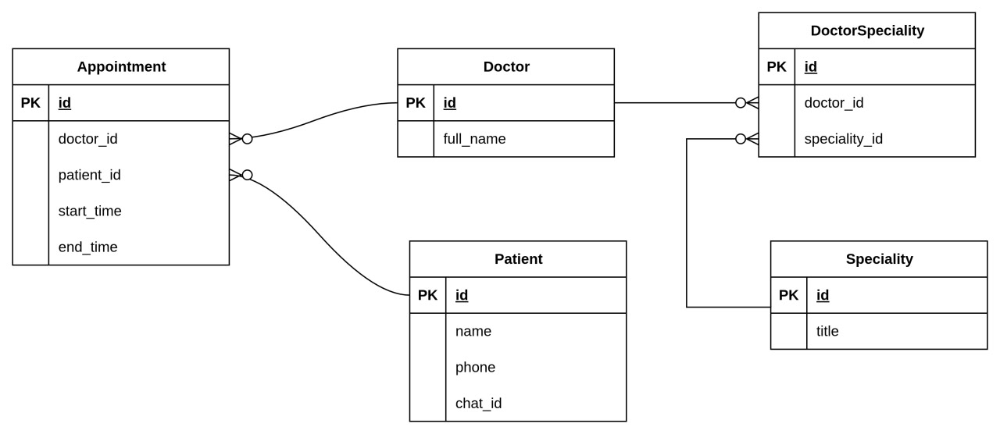

# Appointment project

## Содержание

1. [Описание](#1-описание)
2. [Диаграммы](#2-Диаграммы)
3. [Эндпоинты](#3-Эндпоинты)

## 1. Описание

Минимальный, но полноценный микросервис для записи пациентов

## 2. Диаграммы

[//]: # (er)

    

<h3 align="center">er - диаграмма</h3>

## 3. Эндпоинты

- `POST /appointments` - создать запись;
- `GET /appointments/{id}` - получить запись по ID;